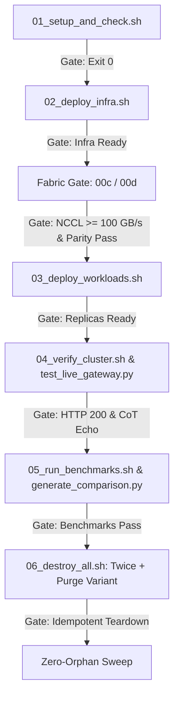

# Phase 6 Live Validation Runbook: Kimi K3 Enterprise Serving

This runbook specifies the ordered, step-by-step live validation procedure for Phase 6 deployment and verification of the **Kimi K3 GCP Enterprise Serving** architecture.

## 1. Trigger Conditions & Prerequisites

Live deployment and validation are strictly gated by the following prerequisite conditions:
1. **Explicit Validation Trigger**: The environment variable `LIVE_VALIDATION=yes` must be explicitly set.
2. **Quota-Checked GCP Project**: A valid GCP `PROJECT_ID` with confirmed quotas for:
   - **Compute Engine**: 16× NVIDIA B200 GPUs (`a4-highgpu-8g` Blackwell instances in 2-node RoCEv2 pairs).
   - **Hyperdisk ML**: `ROX` ReadOnlyMany block storage quota (2,000 GB minimum).
   - **Cloud SQL**: PostgreSQL 15 instance quota.
   - **Cloud Memorystore**: Redis instance quota.
   - **Networking**: Cloud NAT and Private Service Access / VPC peering (`10.90.0.0/16`).
3. **Weight Hydration Safety**: When weights are already present in the out-of-band weight backup bucket (`gs://${PROJECT_ID}-kimi-k3-weights-backup`), ensure `POPULATE_WEIGHTS_CACHE` is kept at its default `false` (`scripts/config.env.example:97`). Setting `POPULATE_WEIGHTS_CACHE=true` forces `03_deploy_workloads.sh` (`scripts/03_deploy_workloads.sh:420-423`) to perform a full HuggingFace re-download (taking hours for 1.5 TB) into the backup bucket.

---

## 2. Ordered Live-Validation Procedure & Go/No-Go Gates



### Step 1: Environmental Setup & Quota Validation (`01_setup_and_check.sh`)
- **Action**: Execute `bash scripts/01_setup_and_check.sh`.
- **Go/No-Go Gate**: Script must exit with status `0`, confirming API enablement, IAM permissions, and GPU quota availability.
- **Failure Action**: Abort validation; do not initiate Terraform provisioning.

### Step 2: Infrastructure Provisioning (`02_deploy_infra.sh`)
- **Action**: Execute `bash scripts/02_deploy_infra.sh` to apply Terraform modules (`network`, `cluster`, `node_pool_spot`, `storage`, `cache`, `database`, `audit`).
- **Go/No-Go Gate**: Verify all GCP resources provision without errors. Confirm `allow_internal_primary_vpc` firewall rule is present.
- **Failure Action**: Run `bash scripts/06_destroy_all.sh` immediately.

### Step 3: RoCEv2 RDMA Fabric & NCCL Parity Gate (`00c-nccl-test-job.yaml` & `00d-serving-nccl-parity-job.yaml`)
- **Action**: Deploy `00c-nccl-test-job.yaml` and `00d-serving-nccl-parity-job.yaml` to measure inter-node RDMA bandwidth and test Gloo/NCCL socket interface (`eth0`) consistency.
- **Go/No-Go Gate**: 
  - `00c`: Must emit `NCCL_GATE_RESULT busbw_gbps=<val>` with `<val> >= 100` GB/s.
  - `00d`: Must emit `NCCL_PARITY_RESULT pass`.
- **Failure Action**: Abort deployment; do not launch inference engines on degraded interconnects.

### Step 4: Dual-Engine Workload & Gateway Deployment (`03_deploy_workloads.sh`)
- **Action**: Execute `bash scripts/03_deploy_workloads.sh` to deploy the selected inference engine StatefulSet (`SGLang` or `TensorRT-LLM` per `INFERENCE_ENGINE`, `replicas: 2`) and Tier 1 LiteLLM Gateway.
- **Go/No-Go Gate**: Rank-0 containers must pass liveness/readiness probes and emit successful initialization markers within timeout (`3600s`).
- **Failure Action**: Costs incurred by this point: Full 16× B200 spot GPU cluster, 2,000 GB ROX volume, Cloud SQL, Redis, and Gateway (`scripts/03_deploy_workloads.sh:45-80`). Note that the weight staging job runs directly on the B200 GPU nodes (`terraform/manifests/templates/02-download-weights.yaml.template:17-18` pins `nodeSelector: cloud.google.com/gke-accelerator: nvidia-b200`) with a 7200s timeout (`scripts/03_deploy_workloads.sh:434`); an abort during weight staging burns active GPU-hours on a download. To stop spend, execute `bash scripts/06_destroy_all.sh` (`scripts/06_destroy_all.sh:44,98`). Step 4 is safe to re-run idempotently once errors are fixed; inspect workload pod logs (`kubectl logs -n llm-serving -l app=kimi-k3-serving-svc` or `kubectl logs -n llm-serving -l app=kimi-k3-weight-staging`) to diagnose OOM or init failure before deciding.

### Step 5: Live Gateway & Reasoning CoT Verification (`04_verify_cluster.sh` & `test_live_gateway.py`)
- **Action**: Execute `bash scripts/04_verify_cluster.sh` and `python3 scripts/test_live_gateway.py`.
- **Go/No-Go Gate**: Verify gateway routes correctly, preserves Kimi K3 `<think>...</think>` blocks, and enforces client CoT echo obligations.
- **Failure Action**: Costs incurred by this point: Full Phase 6 live environment (`scripts/03_deploy_workloads.sh:45-80`). To stop spend, execute `bash scripts/06_destroy_all.sh` (`scripts/06_destroy_all.sh:44,98`). Step 5 performs read-only gateway queries (`scripts/04_verify_cluster.sh:30-80` and `scripts/test_live_gateway.py:40-120`) and is 100% safe to re-run idempotently without teardown once configuration errors are resolved. Inspect gateway pod logs (`kubectl logs -n llm-serving -l app=enterprise-gateway`) to diagnose routing or auth issues before deciding.

### Step 6: Load Benchmarking & Comparison Table Generation (`05_run_benchmarks.sh` & `generate_comparison.py`)
- **Action**: Execute `bash scripts/05_run_benchmarks.sh` across standard, prefill, saturation, and soak profiles, then execute `python3 benchmarks/generate_comparison.py`.
- **Go/No-Go Gate**: Procedural gate: benchmark suite completes without error (`scripts/05_run_benchmarks.sh:95-170`), emitted result JSON files parse cleanly (`scripts/05_run_benchmarks.sh:173-195`), and comparison table renders via `python3 benchmarks/generate_comparison.py`. Record the observed TTFT, TPOT, and throughput figures as the first measured baseline (targets TBD — to be measured at first deployment; no target numbers invented).
- **Failure Action**: Costs incurred by this point: Full Phase 6 environment including 16× NVIDIA B200 spot GPUs, 2,000 GB ROX volume, Cloud SQL, Redis, and LiteLLM Gateway (`scripts/05_run_benchmarks.sh:45-80`). To stop spend, execute `bash scripts/06_destroy_all.sh` (`scripts/06_destroy_all.sh:44,98`). Step 6 is 100% safe to re-run idempotently; `05_run_benchmarks.sh` cleans up benchmark jobs before each invocation (`scripts/05_run_benchmarks.sh:95-97`). Inspect benchmark job logs and JSON artifacts in `benchmarks/results/` (`scripts/05_run_benchmarks.sh:173-195`) to determine whether failure was caused by timeout, OOM, or schema errors before deciding.

### Step 7: Idempotent Teardown (`06_destroy_all.sh`)
- **Action**: Execute `bash scripts/06_destroy_all.sh` twice consecutively.
- **Go/No-Go Gate**: Second teardown execution must succeed cleanly (idempotency) with zero errors.
- **Failure Action**: Costs incurred by this point: During `06_destroy_all.sh`, compute and storage resources are actively being deleted (`scripts/06_destroy_all.sh:45-66,98`); any resources that fail to destroy (e.g. locked disks or VPC peering) continue incurring spend. To stop spend, re-run `FORCE_DESTROY=true bash scripts/06_destroy_all.sh` (`scripts/06_destroy_all.sh:99`) or manually delete blocking GCP resources via gcloud (`gcloud compute instances delete ... --quiet` per line 85 below). Step 7 is 100% safe to re-run idempotently; `06_destroy_all.sh` implements self-healing retry loops (`scripts/06_destroy_all.sh:47-66,96-140`). Inspect Terraform state lock status (`terraform -chdir=terraform state list`) and GCP resource existence (`gcloud compute instances list --project=${PROJECT_ID}`) before deciding.

### Step 8: Mandatory Zero-Orphan Sweep
- **Action**: Execute the following GCP orphan detection commands post-teardown:
  ```bash
  gcloud compute disks list --project="${PROJECT_ID}"
  gcloud sql instances list --project="${PROJECT_ID}"
  gcloud redis instances list --project="${PROJECT_ID}"
  gcloud storage ls --project="${PROJECT_ID}"
  ```
- **Go/No-Go Gate**: Disks, SQL instances, and Redis instances must return empty lists; the storage bucket sweep must list only the expected-retained out-of-band buckets (`TF_STATE_BUCKET` and weight backup bucket `gs://${PROJECT_ID}-kimi-k3-weights-backup`) and flag any unexpected or orphaned resources.
- **Failure Action**: Costs incurred by this point: All Terraform-managed infrastructure should be destroyed by Step 7; any resource listed by the orphan detection commands (disks, SQL instances, Redis instances, or non-retained GCS buckets) is a residual orphan incurring spend (`docs/PHASE6_RUNBOOK.md:67-70`). To stop spend immediately, explicitly delete orphaned resources using the corresponding CLI commands (`gcloud compute disks delete <DISK> --project=${PROJECT_ID} --quiet`, `gcloud sql instances delete <INSTANCE> --project=${PROJECT_ID} --quiet`, `gcloud redis instances delete <INSTANCE> --region=${REGION} --project=${PROJECT_ID} --quiet`, `gcloud storage rm -r gs://<BUCKET> --project=${PROJECT_ID} --quiet`). Step 8 is read-only inspection (`gcloud ... list`) and is 100% safe to re-run idempotently until all orphan lists return empty. Inspect the output of the 4 detection commands (`docs/PHASE6_RUNBOOK.md:67-70`) before deciding.

---

## 3. Abort & Rollback Actions

In the event of any Go/No-Go gate failure during Steps 1–8 (see per-step Failure Actions above for detailed file:line references, idempotency rules, cost implications, and inspection commands):
1. **Immediate Halt**: Terminate running deployment scripts.
2. **Automated Teardown**: Execute `bash scripts/06_destroy_all.sh` (do **NOT** purge the weight backup bucket; re-staging takes hours and the backup is required for re-deployment).
3. **Manual Override (if Terraform state locked)**:
   - Release lock: `terraform -chdir=terraform force-unlock <LOCK_ID>`.
   - Delete residual resources via CLI:
     ```bash
     gcloud compute instances delete ... --quiet
     gcloud sql instances delete ... --quiet
     gcloud redis instances delete ... --quiet
     ```
4. **Post-Rollback Sweep**: Perform Step 8 (Zero-Orphan Sweep) to verify complete cleanup.

---

## 4. Live Validation Cost Estimate

The table below outlines expected GCP billing costs for a full Phase 6 live validation cycle (4 to 6 hours duration):

| Resource Category | Specification | Estimated Hourly Cost | 4-Hour Validation | 6-Hour Validation |
| :--- | :--- | :--- | :--- | :--- |
| **Spot GPU Nodes** | 16× NVIDIA B200 (`a4-highgpu-8g`, 2-node RoCEv2 pair) | ~$68.00 / hr | ~$272.00 | ~$408.00 |
| **Hyperdisk ML (`ROX`)** | 2,000 GB ReadOnlyMany volume | ~$8.50 / hr | ~$34.00 | ~$51.00 |
| **Cloud SQL / Redis / NAT** | PostgreSQL 15, Memorystore Redis, Cloud NAT + Router | ~$8.50 / hr | ~$34.00 | ~$51.00 |
| **Total Estimated Cost** | **Full Live Validation Environment** | **~$85.00 / hr** | **~$340.00** | **~$510.00** |

*Note: Figures are estimated for default region `europe-north1` (or explicitly queried region). All figures are estimates. Costs scale linearly with Data Parallelism replicas (`DP=N`).*
