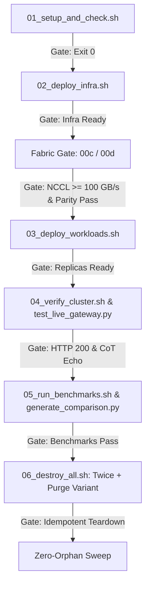

# Phase 6 Live Validation Runbook: Kimi K3 Enterprise Serving

This runbook specifies the ordered, step-by-step live validation procedure for Phase 6 deployment and verification of the **Kimi K3 GCP Enterprise Serving** architecture.

## 1. Trigger Conditions & Prerequisites

Live deployment and validation are strictly gated by the following prerequisite conditions:
1. **Explicit Validation Trigger**: The environment variable `LIVE_VALIDATION=yes` must be explicitly set.
2. **Quota-Checked GCP Project**: A valid GCP `PROJECT_ID` with confirmed quotas for:
   - **Compute Engine**: 16× NVIDIA B200 GPUs (`a4-highgpu-8g` Blackwell instances in 2-node RoCEv2 pairs).
   - **Hyperdisk ML**: `ROX` ReadOnlyMany block storage quota (2,000 GB minimum).
   - **Cloud SQL**: PostgreSQL 15 instance quota.
   - **Cloud Memorystore**: Redis instance quota.
   - **Networking**: Cloud NAT and Private Service Connect (`10.90.0.0/16`).

---

## 2. Ordered Live-Validation Procedure & Go/No-Go Gates



### Step 1: Environmental Setup & Quota Validation (`01_setup_and_check.sh`)
- **Action**: Execute `bash scripts/01_setup_and_check.sh`.
- **Go/No-Go Gate**: Script must exit with status `0`, confirming API enablement, IAM permissions, and GPU quota availability.
- **Failure Action**: Abort validation; do not initiate Terraform provisioning.

### Step 2: Infrastructure Provisioning (`02_deploy_infra.sh`)
- **Action**: Execute `bash scripts/02_deploy_infra.sh` to apply Terraform modules (`network`, `cluster`, `node_pool_spot`, `storage`, `cache`, `database`, `audit`).
- **Go/No-Go Gate**: Verify all GCP resources provision without errors. Confirm `allow_internal_primary_vpc` firewall rule is present.
- **Failure Action**: Run `bash scripts/06_destroy_all.sh` immediately.

### Step 3: RoCEv2 RDMA Fabric & NCCL Parity Gate (`00c-nccl-test-job.yaml` & `00d-serving-nccl-parity-job.yaml`)
- **Action**: Deploy `00c-nccl-test-job.yaml` and `00d-serving-nccl-parity-job.yaml` to measure inter-node RDMA bandwidth and test Gloo/NCCL socket interface (`eth0`) consistency.
- **Go/No-Go Gate**: 
  - `00c`: Must emit `NCCL_GATE_RESULT busbw_gbps=<val>` with `<val> >= 100` GB/s.
  - `00d`: Must emit `NCCL_PARITY_RESULT pass`.
- **Failure Action**: Abort deployment; do not launch inference engines on degraded interconnects.

### Step 4: Dual-Engine Workload & Gateway Deployment (`03_deploy_workloads.sh`)
- **Action**: Execute `bash scripts/03_deploy_workloads.sh` to deploy SGLang and TensorRT-LLM StatefulSets (`replicas: 2`) and Tier 1 LiteLLM Gateway.
- **Go/No-Go Gate**: Rank-0 containers must pass liveness/readiness probes and emit successful initialization markers within timeout (`3600s`).

### Step 5: Live Gateway & Reasoning CoT Verification (`04_verify_cluster.sh` & `test_live_gateway.py`)
- **Action**: Execute `bash scripts/04_verify_cluster.sh` and `python3 scripts/test_live_gateway.py`.
- **Go/No-Go Gate**: Verify gateway routes correctly, preserves Kimi K3 `<think>...</think>` blocks, and enforces client CoT echo obligations.

### Step 6: Load Benchmarking & Comparison Table Generation (`05_run_benchmarks.sh` & `generate_comparison.py`)
- **Action**: Execute `bash scripts/05_run_benchmarks.sh` across standard, prefill, saturation, and soak profiles, then execute `python3 benchmarks/generate_comparison.py`.
- **Go/No-Go Gate**: Ensure TTFT, TPOT, and throughput targets are met and `README.md` comparison table updates cleanly without schema errors.

### Step 7: Idempotent Teardown & Purge Variant (`06_destroy_all.sh`)
- **Action**: Execute `bash scripts/06_destroy_all.sh` twice consecutively, and test with `PURGE_WEIGHTS_CACHE=true`.
- **Go/No-Go Gate**: Second teardown execution must succeed cleanly (idempotency); `PURGE_WEIGHTS_CACHE=true` must remove GCS weight buckets without orphan locks.

### Step 8: Mandatory Zero-Orphan Sweep
- **Action**: Execute the following GCP orphan detection commands post-teardown:
  ```bash
  gcloud compute disks list --project="${PROJECT_ID}"
  gcloud sql instances list --project="${PROJECT_ID}"
  gcloud redis instances list --project="${PROJECT_ID}"
  gcloud storage ls --project="${PROJECT_ID}"
  ```
- **Go/No-Go Gate**: All four commands must return empty lists for validation project resources, confirming zero billing leakage.

---

## 3. Abort & Rollback Actions

In the event of any Go/No-Go gate failure during Steps 1–6:
1. **Immediate Halt**: Terminate running deployment scripts.
2. **Automated Teardown**: Execute `bash scripts/06_destroy_all.sh` with `PURGE_WEIGHTS_CACHE=true`.
3. **Manual Override (if Terraform state locked)**:
   - Release lock: `terraform -chdir=terraform force-unlock <LOCK_ID>`.
   - Delete residual resources via CLI:
     ```bash
     gcloud compute instances delete ... --quiet
     gcloud sql instances delete ... --quiet
     gcloud redis instances delete ... --quiet
     ```
4. **Post-Rollback Sweep**: Perform Step 8 (Zero-Orphan Sweep) to verify complete cleanup.

---

## 4. Live Validation Cost Estimate

The table below outlines expected GCP billing costs for a full Phase 6 live validation cycle (4 to 6 hours duration):

| Resource Category | Specification | Estimated Hourly Cost | 4-Hour Validation | 6-Hour Validation |
| :--- | :--- | :--- | :--- | :--- |
| **Spot GPU Nodes** | 16× NVIDIA B200 (`a4-highgpu-8g`, 2-node RoCEv2 pair) | ~$68.00 / hr | ~$272.00 | ~$408.00 |
| **Hyperdisk ML (`ROX`)** | 2,000 GB ReadOnlyMany volume | ~$8.50 / hr | ~$34.00 | ~$51.00 |
| **Cloud SQL / Redis / NAT** | PostgreSQL 15, Memorystore Redis, Cloud NAT + Router | ~$8.50 / hr | ~$34.00 | ~$51.00 |
| **Total Estimated Cost** | **Full Live Validation Environment** | **~$85.00 / hr** | **~$340.00** | **~$510.00** |

*Note: Estimates based on Google Cloud Spot / us-central1 pricing. Costs scale linearly with Data Parallelism replicas (`DP=N`).*
